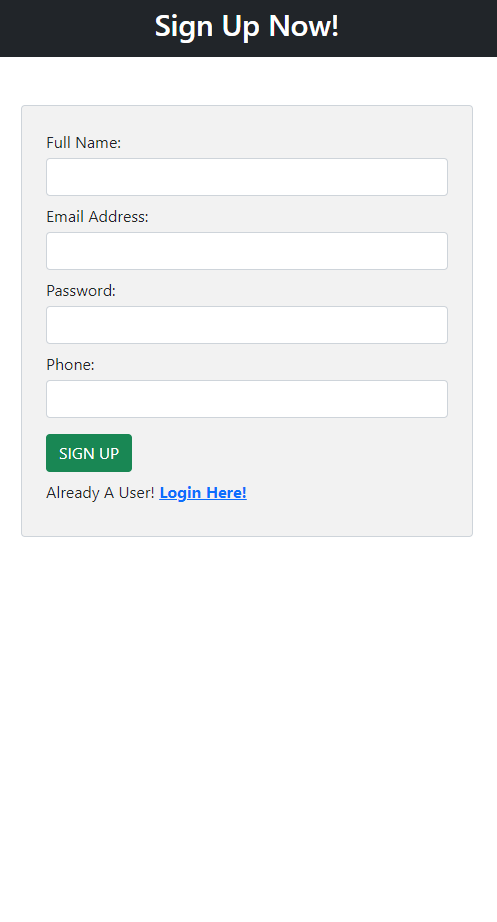
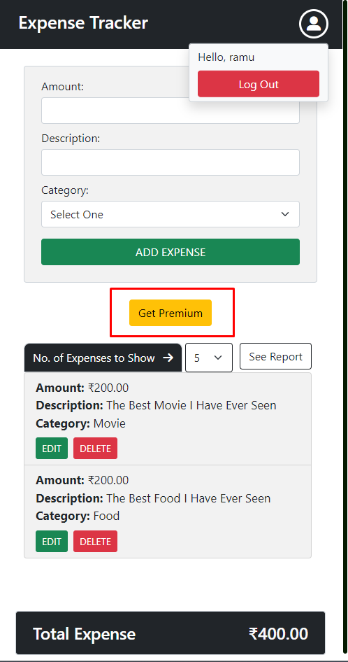
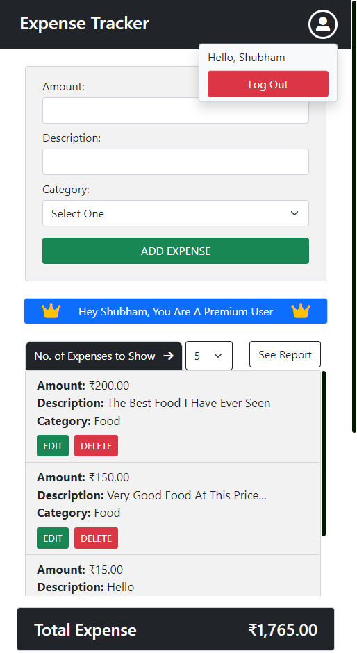
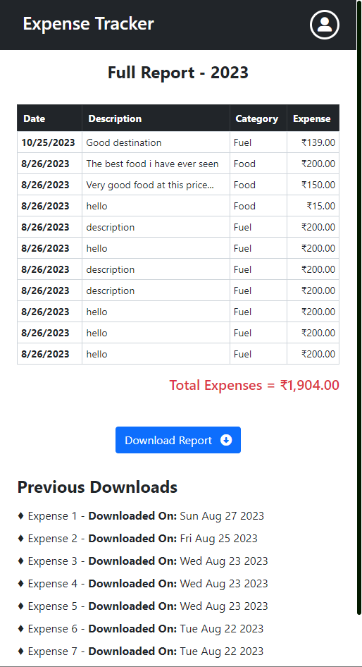
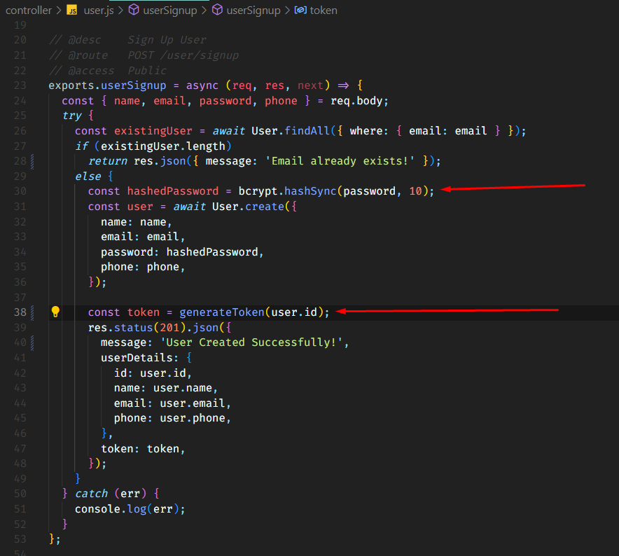

### Sign Up Page

### Login Page

### Password Reset page

### Expense Page for Not A Premium users

### Generate Report page for Not A Premium user

### Razor Pay Implementation

### Expense Page for Premium users

### Leaderboard for Premium users

### Generate Report page for Premium users

### Generate Token using JWT method

### Hashing password using Bcrypt and sending token using above method

### Verifying token setting verified user in request object

### Pagination implementation

